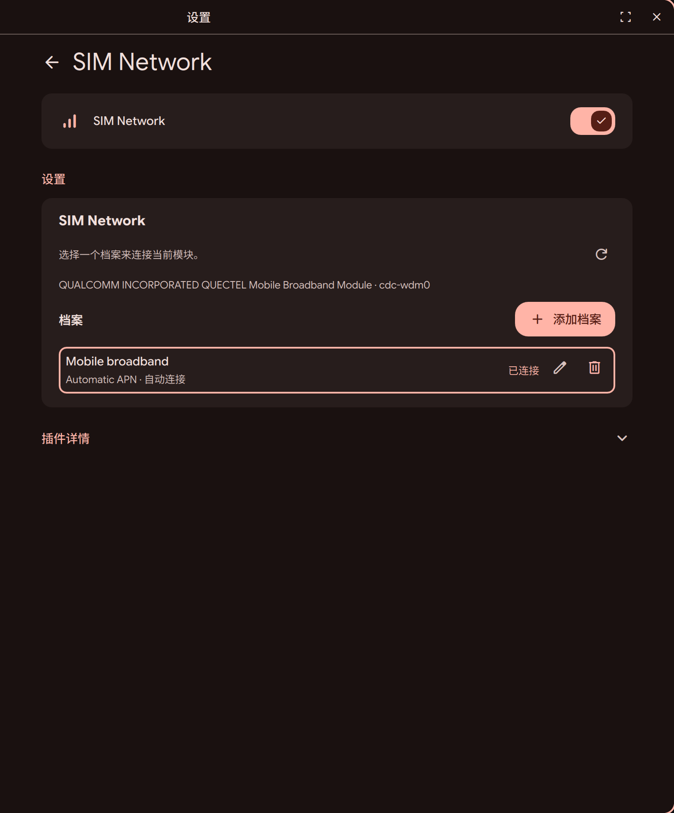

# DMS SIM Network Plugin

A [DankMaterialShell](https://danklinux.com/docs/dankmaterialshell/) plugin for
living with a cellular modem: traffic, SMS/MMS, desktop notifications, and
location — on top of the APN profile management.

The plugin uses **NetworkManager as the only connection backend**.
NetworkManager owns APN profiles, activation, autoconnect, routing, and bearer
lifecycle. ModemManager is queried read-only to enrich the interface with modem,
operator, access-technology, registration, and signal information.

## Features

- SIM Network tile and expanded view in the DMS Control Center
- NetworkManager WWAN radio toggle
- Detection of one or more ModemManager devices
- Persistent selection of the modem used for manual activation
- Live modem model, operator, registration, access technology, and signal data
- Discovery of existing NetworkManager `type=gsm` connections
- Creation, editing, and deletion of persistent APN profiles
- Manual profile activation on a selected modem
- Connected-profile indication for each modem
- NetworkManager-managed autoconnect and priority
- Shared daemon-backed state for the Control Center and Settings pages
- Periodic background refresh without rebuilding state whenever a page opens
- Startup checks for `nmcli` and `mmcli`
- Traffic page: total / used / remaining / today / live throughput
- IP stack toggle (dual-stack, IPv4-only, IPv6-only) and public IPv4/IPv6 lookup
- SMS: conversation view grouped per number, search, paging, copy, unread badges
- MMS: receive with image attachments, send an image via modem-native AT commands
- Desktop notifications for new messages (suppresses re-notify of old ones on boot)
- Obsidian archive of the SMS ledger (optional, auto-detected)
- Cell-tower (3GPP) and GPS location surfaced through GeoClue
- Self-healing when an MMS send is interrupted: the watchdog restores
  ModemManager so the data connection comes back on its own

## Screenshot



## License

MIT — see [LICENSE](LICENSE).

## Architecture

```text
NetworkManager ---- profiles, WWAN, active connections ----+
                                                            |
ModemManager ------- modem and radio information (read-only) +--> Store.qml
                                                                    |
                                      +-----------------------------+------------------+
                                      |                                                |
                               Control Center                                   Plugin Settings
                               ModemWidget.qml                                 ModemSettings.qml
```

`Store.qml` is a persistent DMS daemon component. UI instances consume its
cached state instead of launching a fresh set of commands whenever the Control
Center or Settings page is opened.

The responsibility boundary is intentional:

| Responsibility | Owner |
| --- | --- |
| APN profile storage and persistence | NetworkManager |
| Profile creation, editing, and deletion | NetworkManager |
| Connection activation and disconnection | NetworkManager |
| Autoconnect, priority, routes, DNS, and bearer lifecycle | NetworkManager |
| Modem, operator, registration, access technology, and signal data | ModemManager, read-only |
| Selected modem UI preference | Plugin data |

The plugin never calls `mmcli --simple-connect`, creates or removes a bearer,
or changes modem/SIM configuration through ModemManager.

## Requirements

- DankMaterialShell with composite plugin and daemon support
- NetworkManager and its running system service
- ModemManager and its running system service
- `nmcli`
- `mmcli`
- A modem supported by ModemManager

Optional, only for the extended features:

| Feature | Needs |
| --- | --- |
| Desktop notifications | `notify-send` (libnotify) |
| MMS send | `zenity`, ImageMagick (`convert`), and the `eg25-mms-send` helper |
| MMS receive | `mmsd-tng` with a carrier MMSC configuration |
| SMS archive | an exporter script + an Obsidian vault (auto-detected, silently skipped when absent) |

The helper scripts for these features ship in [`extras/`](extras/) — install
them with `install -Dm755 extras/* ~/.local/bin/`. Anything not installed is
detected and skipped without errors; see [`extras/README.md`](extras/README.md).

On a systemd-based distribution, the services can usually be enabled with:

```sh
sudo systemctl enable --now NetworkManager ModemManager
```

Verify that both services can see the expected state:

```sh
nmcli radio wwan
nmcli connection show
mmcli --list-modems
```

## Installation

For development, link this repository into the DMS plugin directory:

```sh
mkdir -p ~/.config/DankMaterialShell/plugins
ln -s "$(pwd)" ~/.config/DankMaterialShell/plugins/simNetwork
```

Then rescan or reload the plugin:

```sh
dms ipc call plugin-scan rescan simNetwork
dms ipc call plugins reload simNetwork
```

Open **DMS Settings → Plugins**, enable **SIM Network**, and add it to the
Control Center. Use the expanded/50% tile size to make its detail page
available.

Manifest changes, including changes to plugin type or capabilities, require a
rescan. QML-only changes can normally be picked up with a reload.

## Usage

### Control Center

The collapsed tile toggles NetworkManager's global WWAN radio. Open the detail
view to see available GSM profiles.

- With one modem, it is selected automatically and the device selector is
  hidden.
- With multiple modems, select the target modem first.
- Click a profile card to activate it on the selected modem.
- The active profile has a highlighted border and a `Connected` label.
- Use **Add** in the top-right corner to open the profile-creation dialog. It
  includes the common APN, authentication, roaming, and autoconnect options;
  advanced fields remain in Settings.
- Use the settings icon for complete profile management.

### Settings

The Settings page lists all NetworkManager GSM profiles and provides structured
editing for:

- Profile name
- Automatic APN configuration
- APN
- Username and password
- Roaming policy
- Autoconnect
- Autoconnect priority
- Metered mode
- Network ID (MCC/MNC)
- MTU

Saving an existing profile modifies its NetworkManager UUID in place. Creating
a profile lets NetworkManager generate the UUID. Duplicate GSM profile names
are rejected by the plugin.

New profiles are created with `ifname "*"`, so they are not permanently bound
to the current interface name. A concrete modem interface is supplied only for
manual activation:

```sh
nmcli connection up uuid PROFILE_UUID ifname MODEM_INTERFACE
```

NetworkManager remains responsible for deciding which compatible profile to
activate automatically after boot, modem insertion, or WWAN radio recovery.
The plugin does not persist an "active profile" mapping and does not reconnect
profiles by itself at startup.

## Existing profiles

All existing NetworkManager `type=gsm` profiles are shown. Profiles are
identified internally by `connection.uuid`; `connection.id` is used as their
display name.

The editor changes only the fields exposed in the UI. Existing device or SIM
restrictions such as `gsm.device-id`, `gsm.device-uid`, `gsm.sim-id`, and
`gsm.sim-operator-id` are left untouched. NetworkManager makes the final
compatibility decision when a profile is activated.

Legacy plugin-owned APN data is not migrated or used. NetworkManager is the
single source of truth for all profiles.

## Limitations

- Mobile broadband management currently requires the DMS NetworkManager
  backend. DMS installations using standalone iwd, systemd-networkd,
  wpa_supplicant, or ConnMan are not supported by this plugin.
- ModemManager operations are read-only; SIM PIN/PUK, modem modes, bands,
  registration, and bearer management are outside the current scope.
- IPv4 and IPv6 settings are not exposed in the profile editor. They remain
  under NetworkManager's automatic configuration.
- Passwords are passed to `nmcli` when changed and are never read back into the
  editor. Leaving the password field blank while editing keeps the existing
  secret unless **Clear Password** is explicitly selected.
- Backend state is refreshed periodically, so external changes may take a few
  seconds to appear.

## Troubleshooting

Check plugin discovery and loading:

```sh
dms ipc call plugins list
dms ipc call plugins status simNetwork
dms ipc call plugins reload simNetwork
```

Check the underlying services independently:

```sh
nmcli --fields UUID,NAME,TYPE,DEVICE connection show
nmcli --fields UUID,NAME,TYPE,DEVICE connection show --active
mmcli --list-modems --output-json
```

If a profile activation fails, reproduce it through NetworkManager using the
UUID and modem interface shown by the commands above. The plugin intentionally
reports NetworkManager's failure and does not bypass it with a direct
ModemManager connection.

## Repository layout

| File | Purpose |
| --- | --- |
| `plugin.json` | DMS composite plugin manifest |
| `Store.qml` | Persistent daemon state and NetworkManager/ModemManager integration |
| `ModemWidget.qml` | Control Center tile and expanded detail UI |
| `ModemSettings.qml` | Full structured APN profile editor |
| `StartupCheck.qml` | Dependency checks before activation |
| `components/ModemTabs.qml` | Traffic / SMS / MMS tabbed pages |
| `extras/` | Optional helper scripts (MMS send/parse, self-heal, Obsidian archive) |
| `assets/control-center.png` | Tile icon used for notifications |
| `docs/NETWORKMANAGER_BACKEND.md` | Detailed backend and UI design |
| `docs/screenshot.png` | Screenshot shown on the registry site |

For implementation details and command mappings, see
[NetworkManager backend design](docs/NETWORKMANAGER_BACKEND.md). Plugin
integration follows the official
[DMS plugin development guide](https://danklinux.com/docs/dankmaterialshell/plugin-development).
